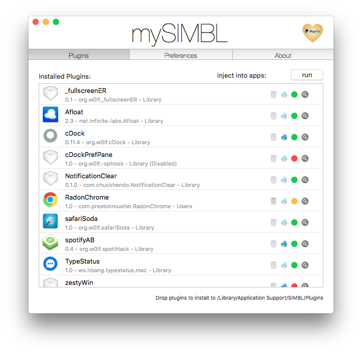

# mySIMBL

mySIMBL is the successor to the application EasySIMBL. It is designed to make managing SIMBL plugins easy and robust on OS X versions 10.9 to 10.11.

This appication uses the older version of SIMBL.osax (0.9.9) since EasySIMBL.osax no longer works on OS X 10.9+ and the original developer does not seem like they are going to update their application or script.

# Installation

* Download the latest release of mySIMBL
* Open mySIMBL
    * You may be required to install SIMBL, mySIMBL will do this for you
    * You may be required to disable System Integrity Protection, mySIMBL will inform you but cannot automate this process

# Current Funtions

* System Integrity Protection warning
* Offers to move self to /Applications
* Drag and drop install bundles in /Library/Application Support/SIMBL/Plugins
* Open bundles with app to install in /Library/Application Support/SIMBL/Plugins
* Show bundle in Finder (Magnifying Glass)
* Toggle bundles between (Colored Circle Icon)
    * /Library/Application Support/SIMBL/Plugins
    * /Library/Application Support/SIMBL/Plugins (Disabled)
    * ~/Library/Application Support/SIMBL/Plugins
* Bundles will display custom icon if located in <bundle>/Contents/icon.icns
    * Otherwise bundles display default bundle icon
* Show bundle developer page (Globe Icon)
    * Must have url included in <bundle>/Contents/Info.plist
    * plist value is string 'DevURL'
* Watch for changes to
    * /Library/Application Support/SIMBL/Plugins
    * ~/Library/Application Support/SIMBL/Plugins

# Goals
* Automatic updates via sparkle
* SIMBL installer
* Finish SIMBL view
* Finish preferences view
* Add discovery view
* Plugin blacklist view
* SIMBL blacklist view
