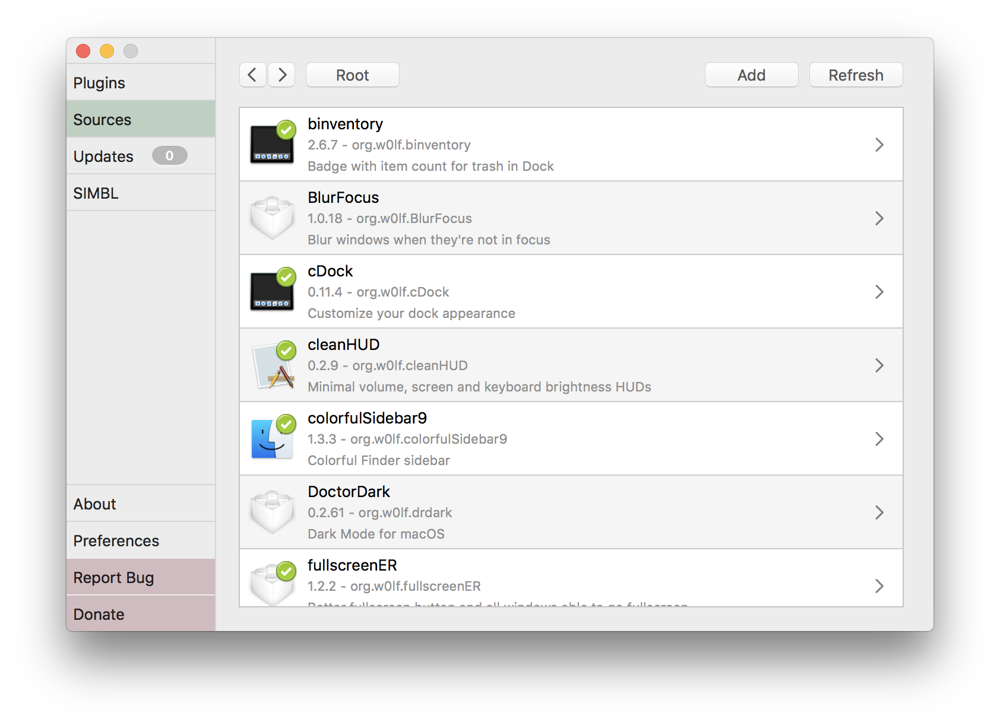

mySIMBL is an open-source plugin manager for macOS. It lets you discover and install plugins to improve the user experience of macOS without the need for manually cloning or copying files.

## Installation

- Download the [latest release](https://github.com/w0lfschild/app_updates/raw/master/mySIMBL/mySIMBL_master.zip)
- Unzip the download if your browser does not do so automatically
- Open mySIMBL
- mySIMBL will ask to be moved to /Applications
- mySIMBL may ask to install or update SIMBL
- You may be required to disable System Integrity Protection, mySIMBL will inform you but cannot automate this process
- Start installing and using plugins

## Requirements

mySIMBL supports macOS 10.9 and above.

## Usage

Select `Discover` from the sidebar, then check or uncheck packages to install or remove them. You'll need to restart affected applications after installing or removing a plugin. Installed plugins are checked for updates each time mySIMBL is launched, but updating is left up to the user.

## Features

- Repositories to find, download and update plugins
- Drag and drop plugins onto mySIMBL to install them
- Open bundles with mySIMBL to install them
- Delete plugins (Trash can)
- Show plugins in Finder (Magnifying Glass)
- Enable/Disable plugins (Colored Circle Icon)
- Show plugin developer page (Globe Icon)
- Detects existing plugins
- Update plugins with ease

## I want to submit my plugin!

Fork the [mySIMBL plugin repository]() and include your package with `name`, `description`, `URL`, and optional `screenshot`. Don't forget to submit a pull request. Further instructions are included in the package repository documentation.

## Development

mySIMBL has a few [contribution guidelines](), for anyone looking to make it more awesome.

## Troubleshooting

Having problems? Submit an issue here: 

## Uninstall

Select `SIMBL` from the sidebar, then click `unistall`. Log out and back in for changes to fully apply.

## Team

[Wolfgang Baird](https://github.com/w0lfschild) ([@w0lfschild](https://github.com/w0lfschild))

## Contribtors

