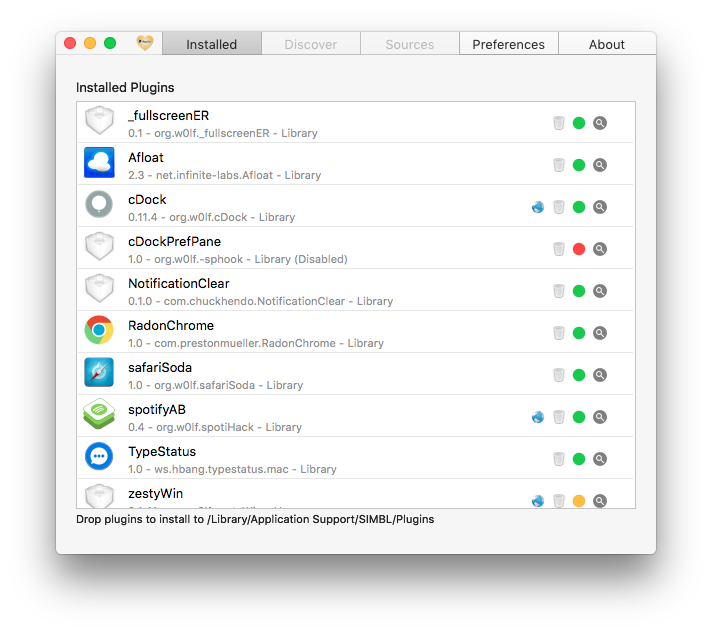

# mySIMBL

mySIMBL is a plugin manager for macOS.

mySIMBL uses a modified version of SIMBL to load plugins into applications. With mySIMBL it is easy to find and update plugins to improve the user experience of macOS. This project was designed as a successor to the application EasySIMBL since both EasySIMBL and the original SIMBL no longer work properly on macOS 10.9 and above due to changes made by Apple. With both projects appearing to be abandoned or left unsupported I decided to create mySIMBL.

# Installation

- Download the [latest release](https://github.com/w0lfschild/app_updates/raw/master/mySIMBL/mySIMBL_master.zip)
- Unzip the download if your browser does not do so automatically
- Open mySIMBL
    - mySIMBL will ask to be moved to /Applications
    - mySIMBL may ask to install or update SIMBL
    - You may be required to disable System Integrity Protection, mySIMBL will inform you but cannot automate this process
- Start installing and using plugins

# Features

- Repositories to find, download and update plugins
- Drag and drop plugins onto mySIMBL to install them
- Open bundles with mySIMBL to install them
- Delete plugins (Trash can)
- Show plugins in Finder (Magnifying Glass)
- Enable/Disable plugins (Colored Circle Icon)
- Show plugin developer page (Globe Icon)
- Detects existing plugins
- Update plugins with ease

# License

